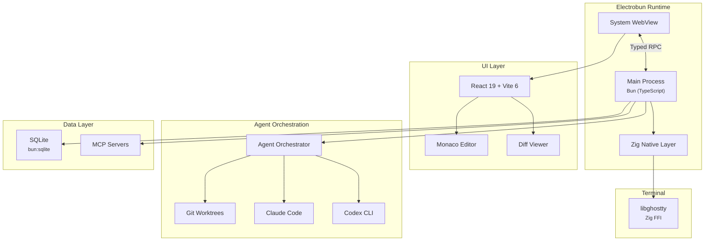

# Piloto

A powerful agentic development environment that makes multi-folder, multi-repo projects first-class in AI-assisted development.

Modern agentic coding tools assume you're working in a single folder or monorepo. Real codebases don't work that way — separate repos for API and frontend, microservices spread across repositories, shared libraries living in their own homes. **Piloto** bridges that gap by letting you orchestrate multiple AI agents across multiple projects simultaneously, using Git worktrees to keep everything isolated and safe.

> **Status:** Early development (v0.1.0) · [Roadmap](#roadmap)

## Features

- **Parallel agents with Git worktrees** — Run multiple AI agents side-by-side, each in its own worktree, so changes stay isolated until you're ready to merge.
- **Multi-project workspaces** — Group related repos into a single workspace and spin up worktrees across all of them for cross-project features.
- **Dual AI backend support** — Work with both [Codex CLI](https://github.com/openai/codex) and [Claude Code](https://docs.anthropic.com/en/docs/claude-code), with [ACP](https://github.com/anthropics/anthropic-cookbook/tree/main/misc/acp) integration.
- **Diff view & change preview** — Review agent-generated changes before committing, with a built-in diff viewer.
- **Integrated terminal** — Powered by [libghostty](https://github.com/ghostty-org/ghostty), embedded directly into the app via Zig FFI.
- **MCP support** — Connect to [Model Context Protocol](https://modelcontextprotocol.io/) servers for extended tool capabilities.
- **Skills** — Reusable prompt-based workflows that agents can leverage.

## Tech Stack

| Layer | Technology |
|---|---|
| Desktop runtime | [Electrobun](https://electrobun.dev/) (Bun + system WebView + Zig) |
| Main process | Bun (TypeScript) |
| UI framework | React 19 + Vite 6 |
| Styling | Tailwind CSS 4 + shadcn/ui |
| Native integration | Zig FFI (libghostty terminal) |
| IPC | Electrobun Typed RPC |
| State management | Zustand |
| Database | SQLite (bun:sqlite) |
| Code editor | Monaco Editor |
| Linting & formatting | Biome |

### Why Electrobun?

Piloto uses [Electrobun](https://electrobun.dev/) instead of Electron. The deciding factor was its **Zig native layer**, which enables direct Zig↔Zig FFI with libghostty — no C bridge needed. It also ships ~14 MB bundles (vs ~200 MB for Electron), starts in under 50 ms, and uses the system WebView instead of bundling Chromium.

## Architecture



## Project Structure

```
piloto/
├── src/
│   ├── bun/              # Main process (Bun runtime)
│   │   └── index.ts      # App entry point, window creation, RPC handlers
│   └── mainview/         # WebView UI (React + Vite)
│       ├── components/   # React components (including shadcn/ui)
│       ├── lib/          # Utilities and Electrobun RPC client
│       ├── index.html    # HTML entry point
│       ├── index.tsx     # React root
│       └── index.css     # Tailwind + theme tokens
├── shared/               # Shared types between main process and WebView
│   └── rpc.ts            # Typed RPC schema (type-safe contract)
├── scripts/              # Build and setup scripts
├── electrobun.config.ts  # App metadata, build settings, platform config
├── vite.config.ts        # Vite build config, dev server, path aliases
├── biome.json            # Linting and formatting rules
└── tsconfig.json         # TypeScript configuration
```

## Getting Started

### Prerequisites

- [Bun](https://bun.sh/) (v1.0+)
- macOS, Linux, or Windows
- Git

### Installation

```bash
git clone https://github.com/your-username/piloto.git
cd piloto
bun install
```

### Running the App

```bash
# Build and launch (one-shot)
bun run start

# Development with file watching (rebuilds on change)
bun run dev

# Development with Hot Module Replacement
bun run dev:hmr
```

When using `dev:hmr`, the Vite dev server runs on port 5173. The main process automatically detects it and loads from there instead of the bundled assets, giving you instant HMR for the UI.

## Development

> **New here?** Read [`CLAUDE.md`](CLAUDE.md) for the project's rules and
> conventions (used by both humans and AI agents), and
> [`docs/DEVELOPMENT.md`](docs/DEVELOPMENT.md) for a narrative walkthrough
> of adding a feature. [`docs/ARCHITECTURE.md`](docs/ARCHITECTURE.md)
> covers the *why* behind the layer boundaries.

### Commands

| Command | Description |
|---|---|
| `bun run start` | Build webview + launch app |
| `bun run dev` | Build + launch with file watching |
| `bun run dev:hmr` | Vite dev server + app (HMR enabled) |
| `bun run build:canary` | Pre-release build |
| `bun run build:stable` | Production release build |
| `bun run lint` | Check with Biome |
| `bun run lint:fix` | Auto-fix lint issues |
| `bun run check` | Biome lint + strict tsc (the canonical pre-commit gate) |
| `bun run check:fix` | Auto-fix lint + strict tsc |
| `bun run scaffold:module <name>` | Create a new Bun feature module under `src/bun/modules/` |
| `bun run scaffold:rpc <module> <method> [query\|mutation\|message]` | Add a new RPC method to an existing module |

### Environment

For Drizzle Kit commands such as `bun run db:migrate`, set `DATABASE_URL` to the SQLite database file you want to target.

An example is provided in `.env.example`:

```bash
cp .env.example .env
export DATABASE_URL=./.context/piloto.db
```

By default, `drizzle.config.ts` falls back to `./.context/piloto.db` when `DATABASE_URL` is not set.

### Database migrations

```bash
bun run db:generate  # Generate SQL migrations from schema changes
bun run db:migrate   # Apply migrations using DATABASE_URL or ./.context/piloto.db
```

### Adding UI Components

This project uses [shadcn/ui](https://ui.shadcn.com/) (New York style). To add components:

```bash
bunx shadcn@latest add button
bunx shadcn@latest add dialog
```

Components are placed in `src/mainview/components/ui/`.

### RPC (Main ↔ WebView)

The type-safe RPC contract lives in `shared/rpc.ts`. Handlers live in
`src/bun/modules/<feature>/<feature>.rpc.ts` (delegating to `.service.ts`)
and are automatically wrapped with logging + error serialization by
`wrapHandlers()` in `src/bun/rpc.ts`. Frontend components consume RPC via
the `useRPCQuery` / `useRPCMutation` / `useRPCSubscription` hooks — never
`electrobun.rpc.request` directly.

Use `bun run scaffold:rpc <module> <method>` to add a new method with the
correct layout. See [`CLAUDE.md`](CLAUDE.md) for the full contract and
[`docs/DEVELOPMENT.md`](docs/DEVELOPMENT.md) for a step-by-step walkthrough.

## Roadmap

### MVP

- [x] Project scaffolding with Electrobun
- [ ] Workspace management (multi-folder projects)
- [ ] Git worktree orchestration
- [ ] Parallel agent execution
- [ ] Claude Code + Codex CLI integration (ACP)
- [ ] Integrated terminal (libghostty via Zig FFI)
- [ ] Diff view and change preview
- [ ] MCP support
- [ ] Skills support

### Post-MVP

- [ ] Integrated browser with password manager compatibility
- [ ] Connections with Linear, Sentry, Slack, and more
- [ ] Dedicated memory per workspace
- [ ] Sandboxed workspace execution
- [ ] Mobile companion app
- [ ] Plugin system

## Contributing

Contributions are welcome! This project is in early development, so things are moving fast.

1. Fork the repository
2. Create your feature branch (`git checkout -b feature/amazing-feature`)
3. Commit your changes (`git commit -m 'Add amazing feature'`)
4. Push to the branch (`git push origin feature/amazing-feature`)
5. Open a Pull Request

Please make sure your code passes `bun run lint` before submitting.

## License

This project is open source. License TBD.

## Acknowledgments

- [Electrobun](https://electrobun.dev/) by [Blackboard](https://blackboard.sh) — the desktop runtime that makes this possible
- [libghostty](https://github.com/ghostty-org/ghostty) — terminal emulation via Zig
- [Claude Code](https://docs.anthropic.com/en/docs/claude-code) and [Codex CLI](https://github.com/openai/codex) — the AI backends Piloto orchestrates
